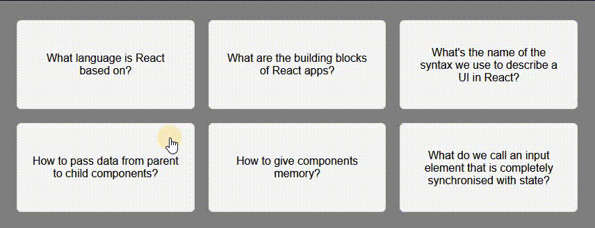

# React - Flashcards

# 🔗 [Live Preview](https://cool-sunshine-ee3086.netlify.app/)

---

## About 👋

The application provides a visual interface for interacting with flashcards. Click on a question to reveal the answer and test your understanding. Click the same question again to hide the answer and practice recall.

---

## Features 👨‍💻

- Displays a list of flashcards with questions.
- Clicking a flashcard reveals the corresponding answer on the same card.
- Clicking the same flashcard again hides the answer, providing a self-paced learning experience.

---

## Data

- The questions and answers are stored in the questions array within the FlashCards component. You can easily add or remove these data entries to test more complex usages of map method, conditional rendering or modifying useState.

---

## Languages

- React: functions, conditionals, useState, components
- Styling: basic
